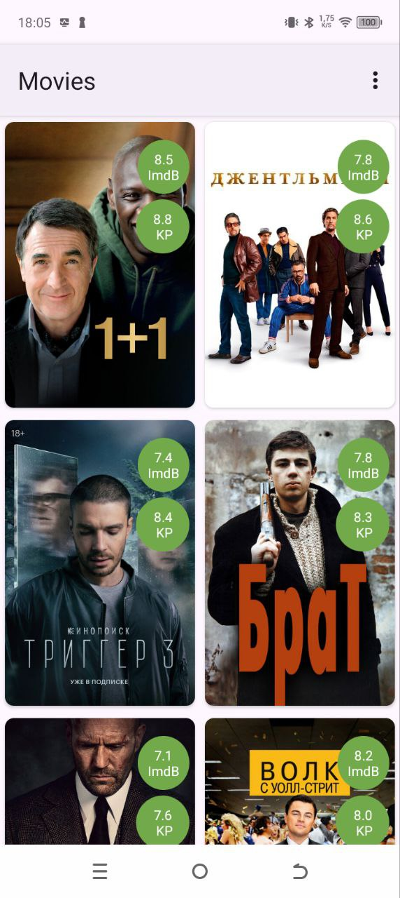
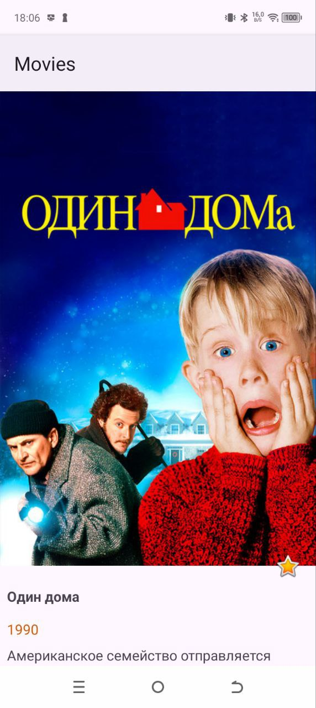
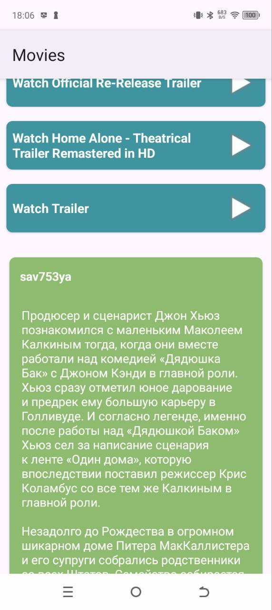

# Movies Android App

## Описание

Учебное клиент-серверное приложение на базе API Kinopoisk. Приложение позволяет пользователю просматривать список фильмов, детальную информацию о фильме (в том числе просмотр трейлеров во внешних источниках), а также добавлять фильмы в избранное.

---

## Функциональные возможности

- **Главный экран** 
    - Просмотр списка фильмов
    - Возможность перейти на экран детальной информации о фильме
    - Возможность перейти в раздел избранное
- **Экран детальной информации:**
    - Просмотор детальной информации о фильме
    - Просмотр трейлеров
    - Добавление фильма в избранное/удаление из избранного
- **Экран избранных фильмов:**
    - Просмотр любимых фильмов локально, при отсутствии интернета
---

## Технологии

### Архитектура и принципы:
- Асинхронность: RxJava

### UI и навигация:
- Activity-based UI
- RecyclerView
- Menu

### Сетевой и локальный доступ:
- API: Retrofit
- Room (локальная БД)
---

## Скриншоты

### Главная 

  

### Экран детальной информации 

  
  

---

## Лицензия

Этот проект распространяется под лицензией MIT.
